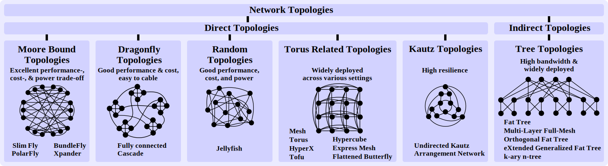

# EvalNet

<p align="center">
  
</p>

This is the official implementation of [EvalNet: A Practical Toolchain for Generation and Analysis of Extreme-Scale Interconnects](http://arxiv.org/abs/2105.12663).

EvalNet is a toolchain for scalable generation and analysis over 25 important network topologies, such as Slim Fly, PolarFly, and Orthogonal Fat Trees, with a strong focus on path diversity metrics.
EvalNet provides an extensive and fine-grained analysis of shortest and non-shortest paths, including their multiplicities, lengths, and interference.


## Setup Guide

In order to use this framework, you need to have a working installation of Python 3.9 or newer.


### Installing EvalNet

Before running the installation, make sure to activate your Python environment (if any) beforehand.

```
git clone https://github.com/spcl/EvalNet.git
cd EvalNet
pip install .
apt-get install libsqlite3-dev
cd analysis
make
```
Our analysis code depends on libsqlite3, so please install its development files (header, static libraries) via your distributions packet manager.
If necessary, please update the C compiler (default: gcc) before compiling the source code in the `analysis` directory.


## Usage

We have integrated all currently supported functionality into a single tool.

```
python3 tool.py -h
usage: tool.py [-h] {generate,validate,clean,info,analyse,plot,show,ggplot,ggplot2} ...

positional arguments:
  {generate,validate,clean,info,analyse,plot,show,ggplot,ggplot2}
                        type of operation
    generate            generates a topology
    validate            validates a topology
    clean               removes generated topologies
    info                saves information about selected topologies
    analyse             analysing tool
    plot                plotting tool
    show                Execute a SQL query and show the results.
    ggplot              Execute a SQL query and plot results using python-ggplot. Uses matplotlib, pandas and the ggplot package.
    ggplot2             Execute a SQL query and plot results using R ggplot2. Requires sqldf and ggplot2 for R.

optional arguments:
  -h, --help            show this help message and exit
```
Specifically the tool supports the generation of new topologies (more in [topogen/README.md](topogen/README.md)), the analysis of already generated topologies as well as plotting the analyzed metrics (more in [analysis/README.md](analysis/README.md)).


## Supported Topologies

EvalNet supports the following topologies:
- n-dimensional hypercube
- k-ary n-dimensional torus
- k-ary n-flat (Flattened Butterfly)
- h-MLFM (Multi-Layer Full-Mesh)
- k-OFT (Two-Level k-Orthogonal Fat-Tree)
- Jellyfish (r-regular)
- regular HyperX
- Dragonfly (balanced)
- Fat-Tree (three-stage variant)
- Xpander
- 2x oversubscribed Fat-Tree
- Slim Fly
- Delorme
- Brown/Erdos-Renyi (ER) Graphs
- incremental extensions of Brown/ER graphs
- Bundlefly
- Kautz
- arrangement network
- extended generalized Fat Tree
- k-ary-n tree
- mesh
- Tofu
- Cascade Dragonfly
- Spectralfly
- Megafly
- Polarstar


The general command line interface for the topology generation can be found below:
```
usage: tool.py generate [-h]
                        {hypercube,torus,flatbutterfly,mlfm,oft,jellyfish,hyperx,dragonfly,fattree,xpander,slimfly,delorme,brown,brown_ext,bundlefly,kautz,arrnetwork,xgft,karyn,mesh,tofu,casdf,specfly,megafly,polarstar} ...

positional arguments:
  {hypercube,torus,flatbutterfly,mlfm,oft,jellyfish,hyperx,dragonfly,fattree,xpander,slimfly,delorme,brown,brown_ext,bundlefly,kautz,arrnetwork,xgft,karyn,mesh,tofu,casdf,specfly,megafly,polarstar}
                        type of topology
    hypercube           generates a n-dimensional Hypercube topology
    torus               generates a k-ary n-Torus topology
    flatbutterfly       generates a k-ary n-flat (Flattened Butterfly)
    mlfm                generates a h-MLFM topology (Multi-Layer Full-Mesh)
    oft                 generates a k-OFT topology (Two-Level Orthogonal Fat-Tree)
    jellyfish           generates a r-regular Jellyfish topology
    hyperx              generates a regular HyperX topology
    dragonfly           generates a Dragonfly topology
    fattree             generates a FatTree topology
    xpander             generates a Xpander topology
    slimfly             generates a SlimFly topology
    delorme             generates a Delorme topology
    brown               generates a Brown topology
    brown_ext           generates incremental expansions of a Brown topology
    bundlefly           generates bundlefly
    kautz               generates kautz
    arrnetwork          generates arrangement network
    xgft                generates extended generalized fat tree
    karyn               generates k-ary-n Tree
    mesh                generates Mesh k^n
    tofu                generates Tofu 6D Tofu
    casdf               generates Cascade Dragonfly (a=96,p=8,h=10) with g groups
    specfly             construct lps graphs (spectralfly)
    megafly             construct megafly
    polarstar           construct polarstar

optional arguments:
  -h, --help            show this help message and exit
```
We document the supported parameters for each topology in [topogen/README.md](topogen/README.md).

The output of the generated topologies is stored in the respective topology directory of the `data` directory.

## Supported Measures

EvalNet supports the following measures:
- shortest path length
- shortest path multiplicity
- count of edge disjoint paths
- path interference

The analyze part of the tool comes with the following command line interface:
```
usage: tool.py analyse [-h] {shortestpaths,disjointpaths,interference} ...

positional arguments:
  {shortestpaths,disjointpaths,interference}
                        type of analysis
    shortestpaths       analyses shortest paths
    disjointpaths       analyses disjoint paths
    interference        analyses interference

optional arguments:
  -h, --help            show this help message and exit
```
We document the supported parameters for each measure in [analysis/README.md](analysis/README.md#measures).

Multiple topologies as well as the topologies classes, i.e. the number of nodes in the network, can be specified.
The output of the analysis is stored in `data/analysis/{analysis type}.db`.

## Supported Visualizations

EvalNet supports the following visualizations:
- histogram of shortest path length
- histogram of shortest path multiplicity
- histogram of count of edge disjoint paths
- 2-dimentional map of low connectivity pairs
- histogram of path interference
- detailed view of path interference

The respective tool part has the following command line interface:
```
usage: tool.py plot [-h] {shortestpaths,multiplicity,disjointpaths,interference,interferencedetail,lowconnectivity} ...

positional arguments:
  {shortestpaths,multiplicity,disjointpaths,interference,interferencedetail,lowconnectivity}
                        type of plot
    shortestpaths       plots shortest paths
    multiplicity        plots shortest paths multiplicity
    disjointpaths       plots histogram of disjoint paths
    interference        plots histogram showing interference
    interferencedetail  plots histogram showing interference
    lowconnectivity     low connectivity plot

optional arguments:
  -h, --help            show this help message and exit
```
We document the supported parameters for each visualization in [analysis/README.md](analysis/README.md#visualizations).


## Citations

If you find this repository useful, please consider giving it a star! If you have any questions or feedback, don't hesitate to reach out and open an issue.

When using EvalNet in your work, please reference us with the citation provided below:

```bibtex
@misc{besta2025evalnet,
  title = {{EvalNet: A Practical Toolchain for Generation and Analysis of Extreme-Scale Interconnects}},
  author = {Besta, Maciej and Patrick Iff and Marcel Schneider and Nils Blach and Alessandro Maissen and Salvatore Di Girolamo and Jens Domke and Jascha Krattenmacher and Ankit Singla and Kartik Lakhotia and Laura Monroe and Fabrizio Petrini and Robert Gerstenberger and Hoefler, Torsten},
  year = 2025,
  month = Jun,
  doi = {10.48550/arXiv.2105.12663},
  url = {http://arxiv.org/abs/2105.12663},
  eprinttype = {arXiv},
  eprint = {2105.12663}
}
```
