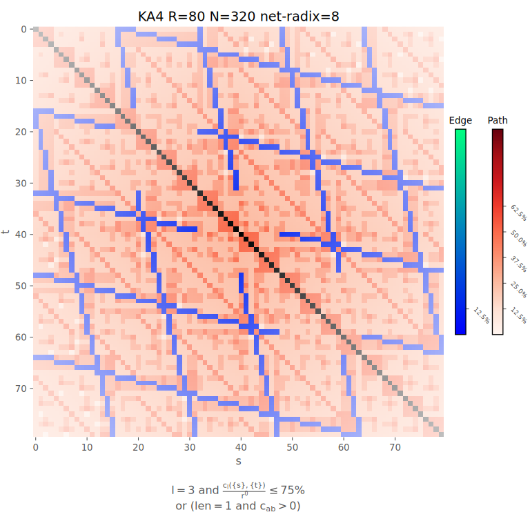

# Analysis

## Measures

### Shortest Paths
```
usage: tool.py analyse shortestpaths [-h] [-s] [--parallel] -t
                                     {HC,3DTorus,4DTorus,5DTorus,6DTorus,1DFB,2DFB,3DFB,4DFB,5DFB,6DFB,MLFM,OFT,HX2,HX3,DF,Xp,Xpp,FT,FT2x,SF,DEL,BRO,BRO_EXT,BUNDLE,2KAUTZ,3KAUTZ,4KAUTZ,5KAUTZ,6KAUTZ,8KAUTZ,KAUTZ,AN,2AN,3AN,4AN,5AN,6AN,8AN,16AN,XGFT4,XGFT8,XGFT8S,XGFT,KARYN,KARY2,KARY3,KARY4,KARY5,KARY6,KARY7,KARY8,KARY16,8ARYN,16ARYN,2dMESH,3dMESH,4dMESH,5dMESH,6dMESH,2dExpMESH2,3dExpMESH2,4dExpMESH2,5dExpMESH2,6dExpMESH2,2dExpMESH3,3dExpMESH3,4dExpMESH3,5dExpMESH3,6dExpMESH3,2dExpMESH4,3dExpMESH4,4dExpMESH4,5dExpMESH4,6dExpMESH4,TOFU,CASDF,SPECFLY,MEGAFLY2,MEGAFLY3,MEGAFLY4,MEGAFLY8,MEGAFLY16,MEGAFLY32,POLARSTARmax,POLARSTARbdf,POLARSTARpaley}
                                     [{HC,3DTorus,4DTorus,5DTorus,6DTorus,1DFB,2DFB,3DFB,4DFB,5DFB,6DFB,MLFM,OFT,HX2,HX3,DF,Xp,Xpp,FT,FT2x,SF,DEL,BRO,BRO_EXT,BUNDLE,2KAUTZ,3KAUTZ,4KAUTZ,5KAUTZ,6KAUTZ,8KAUTZ,KAUTZ,AN,2AN,3AN,4AN,5AN,6AN,8AN,16AN,XGFT4,XGFT8,XGFT8S,XGFT,KARYN,KARY2,KARY3,KARY4,KARY5,KARY6,KARY7,KARY8,KARY16,8ARYN,16ARYN,2dMESH,3dMESH,4dMESH,5dMESH,6dMESH,2dExpMESH2,3dExpMESH2,4dExpMESH2,5dExpMESH2,6dExpMESH2,2dExpMESH3,3dExpMESH3,4dExpMESH3,5dExpMESH3,6dExpMESH3,2dExpMESH4,3dExpMESH4,4dExpMESH4,5dExpMESH4,6dExpMESH4,TOFU,CASDF,SPECFLY,MEGAFLY2,MEGAFLY3,MEGAFLY4,MEGAFLY8,MEGAFLY16,MEGAFLY32,POLARSTARmax,POLARSTARbdf,POLARSTARpaley} ...]
                                     -c CLASSES [CLASSES ...] [-l MAXLENGTH] [-j]

optional arguments:
  -h, --help            show this help message and exit
  -s, --sparse          use sparse matrices
  --parallel            uses parallel matrix multiplication
  -t {HC,3DTorus,4DTorus,5DTorus,6DTorus,1DFB,2DFB,3DFB,4DFB,5DFB,6DFB,MLFM,OFT,HX2,HX3,DF,Xp,Xpp,FT,FT2x,SF,DEL,BRO,BRO_EXT,BUNDLE,2KAUTZ,3KAUTZ,4KAUTZ,5KAUTZ,6KAUTZ,8KAUTZ,KAUTZ,AN,2AN,3AN,4AN,5AN,6AN,8AN,16AN,XGFT4,XGFT8,XGFT8S,XGFT,KARYN,KARY2,KARY3,KARY4,KARY5,KARY6,KARY7,KARY8,KARY16,8ARYN,16ARYN,2dMESH,3dMESH,4dMESH,5dMESH,6dMESH,2dExpMESH2,3dExpMESH2,4dExpMESH2,5dExpMESH2,6dExpMESH2,2dExpMESH3,3dExpMESH3,4dExpMESH3,5dExpMESH3,6dExpMESH3,2dExpMESH4,3dExpMESH4,4dExpMESH4,5dExpMESH4,6dExpMESH4,TOFU,CASDF,SPECFLY,MEGAFLY2,MEGAFLY3,MEGAFLY4,MEGAFLY8,MEGAFLY16,MEGAFLY32,POLARSTARmax,POLARSTARbdf,POLARSTARpaley} [{HC,3DTorus,4DTorus,5DTorus,6DTorus,1DFB,2DFB,3DFB,4DFB,5DFB,6DFB,MLFM,OFT,HX2,HX3,DF,Xp,Xpp,FT,FT2x,SF,DEL,BRO,BRO_EXT,BUNDLE,2KAUTZ,3KAUTZ,4KAUTZ,5KAUTZ,6KAUTZ,8KAUTZ,KAUTZ,AN,2AN,3AN,4AN,5AN,6AN,8AN,16AN,XGFT4,XGFT8,XGFT8S,XGFT,KARYN,KARY2,KARY3,KARY4,KARY5,KARY6,KARY7,KARY8,KARY16,8ARYN,16ARYN,2dMESH,3dMESH,4dMESH,5dMESH,6dMESH,2dExpMESH2,3dExpMESH2,4dExpMESH2,5dExpMESH2,6dExpMESH2,2dExpMESH3,3dExpMESH3,4dExpMESH3,5dExpMESH3,6dExpMESH3,2dExpMESH4,3dExpMESH4,4dExpMESH4,5dExpMESH4,6dExpMESH4,TOFU,CASDF,SPECFLY,MEGAFLY2,MEGAFLY3,MEGAFLY4,MEGAFLY8,MEGAFLY16,MEGAFLY32,POLARSTARmax,POLARSTARbdf,POLARSTARpaley} ...], --topos {HC,3DTorus,4DTorus,5DTorus,6DTorus,1DFB,2DFB,3DFB,4DFB,5DFB,6DFB,MLFM,OFT,HX2,HX3,DF,Xp,Xpp,FT,FT2x,SF,DEL,BRO,BRO_EXT,BUNDLE,2KAUTZ,3KAUTZ,4KAUTZ,5KAUTZ,6KAUTZ,8KAUTZ,KAUTZ,AN,2AN,3AN,4AN,5AN,6AN,8AN,16AN,XGFT4,XGFT8,XGFT8S,XGFT,KARYN,KARY2,KARY3,KARY4,KARY5,KARY6,KARY7,KARY8,KARY16,8ARYN,16ARYN,2dMESH,3dMESH,4dMESH,5dMESH,6dMESH,2dExpMESH2,3dExpMESH2,4dExpMESH2,5dExpMESH2,6dExpMESH2,2dExpMESH3,3dExpMESH3,4dExpMESH3,5dExpMESH3,6dExpMESH3,2dExpMESH4,3dExpMESH4,4dExpMESH4,5dExpMESH4,6dExpMESH4,TOFU,CASDF,SPECFLY,MEGAFLY2,MEGAFLY3,MEGAFLY4,MEGAFLY8,MEGAFLY16,MEGAFLY32,POLARSTARmax,POLARSTARbdf,POLARSTARpaley} [{HC,3DTorus,4DTorus,5DTorus,6DTorus,1DFB,2DFB,3DFB,4DFB,5DFB,6DFB,MLFM,OFT,HX2,HX3,DF,Xp,Xpp,FT,FT2x,SF,DEL,BRO,BRO_EXT,BUNDLE,2KAUTZ,3KAUTZ,4KAUTZ,5KAUTZ,6KAUTZ,8KAUTZ,KAUTZ,AN,2AN,3AN,4AN,5AN,6AN,8AN,16AN,XGFT4,XGFT8,XGFT8S,XGFT,KARYN,KARY2,KARY3,KARY4,KARY5,KARY6,KARY7,KARY8,KARY16,8ARYN,16ARYN,2dMESH,3dMESH,4dMESH,5dMESH,6dMESH,2dExpMESH2,3dExpMESH2,4dExpMESH2,5dExpMESH2,6dExpMESH2,2dExpMESH3,3dExpMESH3,4dExpMESH3,5dExpMESH3,6dExpMESH3,2dExpMESH4,3dExpMESH4,4dExpMESH4,5dExpMESH4,6dExpMESH4,TOFU,CASDF,SPECFLY,MEGAFLY2,MEGAFLY3,MEGAFLY4,MEGAFLY8,MEGAFLY16,MEGAFLY32,POLARSTARmax,POLARSTARbdf,POLARSTARpaley} ...]
                        specifies the topologies
  -c CLASSES [CLASSES ...], --classes CLASSES [CLASSES ...]
                        specifies the classes defining the number of host a topology have
  -l MAXLENGTH, --maxlength MAXLENGTH
                        specifies the maxiumum length of search space
  -j, --jellyfish       for each topology the jellyfish equivalent topology is also analysed
```

### Disjoint Paths
```
usage: tool.py analyse disjointpaths [-h] -t
                                     {HC,3DTorus,4DTorus,5DTorus,6DTorus,1DFB,2DFB,3DFB,4DFB,5DFB,6DFB,MLFM,OFT,HX2,HX3,DF,Xp,Xpp,FT,FT2x,SF,DEL,BRO,BRO_EXT,BUNDLE,2KAUTZ,3KAUTZ,4KAUTZ,5KAUTZ,6KAUTZ,8KAUTZ,KAUTZ,AN,2AN,3AN,4AN,5AN,6AN,8AN,16AN,XGFT4,XGFT8,XGFT8S,XGFT,KARYN,KARY2,KARY3,KARY4,KARY5,KARY6,KARY7,KARY8,KARY16,8ARYN,16ARYN,2dMESH,3dMESH,4dMESH,5dMESH,6dMESH,2dExpMESH2,3dExpMESH2,4dExpMESH2,5dExpMESH2,6dExpMESH2,2dExpMESH3,3dExpMESH3,4dExpMESH3,5dExpMESH3,6dExpMESH3,2dExpMESH4,3dExpMESH4,4dExpMESH4,5dExpMESH4,6dExpMESH4,TOFU,CASDF,SPECFLY,MEGAFLY2,MEGAFLY3,MEGAFLY4,MEGAFLY8,MEGAFLY16,MEGAFLY32,POLARSTARmax,POLARSTARbdf,POLARSTARpaley}
                                     [{HC,3DTorus,4DTorus,5DTorus,6DTorus,1DFB,2DFB,3DFB,4DFB,5DFB,6DFB,MLFM,OFT,HX2,HX3,DF,Xp,Xpp,FT,FT2x,SF,DEL,BRO,BRO_EXT,BUNDLE,2KAUTZ,3KAUTZ,4KAUTZ,5KAUTZ,6KAUTZ,8KAUTZ,KAUTZ,AN,2AN,3AN,4AN,5AN,6AN,8AN,16AN,XGFT4,XGFT8,XGFT8S,XGFT,KARYN,KARY2,KARY3,KARY4,KARY5,KARY6,KARY7,KARY8,KARY16,8ARYN,16ARYN,2dMESH,3dMESH,4dMESH,5dMESH,6dMESH,2dExpMESH2,3dExpMESH2,4dExpMESH2,5dExpMESH2,6dExpMESH2,2dExpMESH3,3dExpMESH3,4dExpMESH3,5dExpMESH3,6dExpMESH3,2dExpMESH4,3dExpMESH4,4dExpMESH4,5dExpMESH4,6dExpMESH4,TOFU,CASDF,SPECFLY,MEGAFLY2,MEGAFLY3,MEGAFLY4,MEGAFLY8,MEGAFLY16,MEGAFLY32,POLARSTARmax,POLARSTARbdf,POLARSTARpaley} ...]
                                     -c CLASSES [CLASSES ...] [-l MAXLENGTH] [-j]

optional arguments:
  -h, --help            show this help message and exit
  -t {HC,3DTorus,4DTorus,5DTorus,6DTorus,1DFB,2DFB,3DFB,4DFB,5DFB,6DFB,MLFM,OFT,HX2,HX3,DF,Xp,Xpp,FT,FT2x,SF,DEL,BRO,BRO_EXT,BUNDLE,2KAUTZ,3KAUTZ,4KAUTZ,5KAUTZ,6KAUTZ,8KAUTZ,KAUTZ,AN,2AN,3AN,4AN,5AN,6AN,8AN,16AN,XGFT4,XGFT8,XGFT8S,XGFT,KARYN,KARY2,KARY3,KARY4,KARY5,KARY6,KARY7,KARY8,KARY16,8ARYN,16ARYN,2dMESH,3dMESH,4dMESH,5dMESH,6dMESH,2dExpMESH2,3dExpMESH2,4dExpMESH2,5dExpMESH2,6dExpMESH2,2dExpMESH3,3dExpMESH3,4dExpMESH3,5dExpMESH3,6dExpMESH3,2dExpMESH4,3dExpMESH4,4dExpMESH4,5dExpMESH4,6dExpMESH4,TOFU,CASDF,SPECFLY,MEGAFLY2,MEGAFLY3,MEGAFLY4,MEGAFLY8,MEGAFLY16,MEGAFLY32,POLARSTARmax,POLARSTARbdf,POLARSTARpaley} [{HC,3DTorus,4DTorus,5DTorus,6DTorus,1DFB,2DFB,3DFB,4DFB,5DFB,6DFB,MLFM,OFT,HX2,HX3,DF,Xp,Xpp,FT,FT2x,SF,DEL,BRO,BRO_EXT,BUNDLE,2KAUTZ,3KAUTZ,4KAUTZ,5KAUTZ,6KAUTZ,8KAUTZ,KAUTZ,AN,2AN,3AN,4AN,5AN,6AN,8AN,16AN,XGFT4,XGFT8,XGFT8S,XGFT,KARYN,KARY2,KARY3,KARY4,KARY5,KARY6,KARY7,KARY8,KARY16,8ARYN,16ARYN,2dMESH,3dMESH,4dMESH,5dMESH,6dMESH,2dExpMESH2,3dExpMESH2,4dExpMESH2,5dExpMESH2,6dExpMESH2,2dExpMESH3,3dExpMESH3,4dExpMESH3,5dExpMESH3,6dExpMESH3,2dExpMESH4,3dExpMESH4,4dExpMESH4,5dExpMESH4,6dExpMESH4,TOFU,CASDF,SPECFLY,MEGAFLY2,MEGAFLY3,MEGAFLY4,MEGAFLY8,MEGAFLY16,MEGAFLY32,POLARSTARmax,POLARSTARbdf,POLARSTARpaley} ...], --topos {HC,3DTorus,4DTorus,5DTorus,6DTorus,1DFB,2DFB,3DFB,4DFB,5DFB,6DFB,MLFM,OFT,HX2,HX3,DF,Xp,Xpp,FT,FT2x,SF,DEL,BRO,BRO_EXT,BUNDLE,2KAUTZ,3KAUTZ,4KAUTZ,5KAUTZ,6KAUTZ,8KAUTZ,KAUTZ,AN,2AN,3AN,4AN,5AN,6AN,8AN,16AN,XGFT4,XGFT8,XGFT8S,XGFT,KARYN,KARY2,KARY3,KARY4,KARY5,KARY6,KARY7,KARY8,KARY16,8ARYN,16ARYN,2dMESH,3dMESH,4dMESH,5dMESH,6dMESH,2dExpMESH2,3dExpMESH2,4dExpMESH2,5dExpMESH2,6dExpMESH2,2dExpMESH3,3dExpMESH3,4dExpMESH3,5dExpMESH3,6dExpMESH3,2dExpMESH4,3dExpMESH4,4dExpMESH4,5dExpMESH4,6dExpMESH4,TOFU,CASDF,SPECFLY,MEGAFLY2,MEGAFLY3,MEGAFLY4,MEGAFLY8,MEGAFLY16,MEGAFLY32,POLARSTARmax,POLARSTARbdf,POLARSTARpaley} [{HC,3DTorus,4DTorus,5DTorus,6DTorus,1DFB,2DFB,3DFB,4DFB,5DFB,6DFB,MLFM,OFT,HX2,HX3,DF,Xp,Xpp,FT,FT2x,SF,DEL,BRO,BRO_EXT,BUNDLE,2KAUTZ,3KAUTZ,4KAUTZ,5KAUTZ,6KAUTZ,8KAUTZ,KAUTZ,AN,2AN,3AN,4AN,5AN,6AN,8AN,16AN,XGFT4,XGFT8,XGFT8S,XGFT,KARYN,KARY2,KARY3,KARY4,KARY5,KARY6,KARY7,KARY8,KARY16,8ARYN,16ARYN,2dMESH,3dMESH,4dMESH,5dMESH,6dMESH,2dExpMESH2,3dExpMESH2,4dExpMESH2,5dExpMESH2,6dExpMESH2,2dExpMESH3,3dExpMESH3,4dExpMESH3,5dExpMESH3,6dExpMESH3,2dExpMESH4,3dExpMESH4,4dExpMESH4,5dExpMESH4,6dExpMESH4,TOFU,CASDF,SPECFLY,MEGAFLY2,MEGAFLY3,MEGAFLY4,MEGAFLY8,MEGAFLY16,MEGAFLY32,POLARSTARmax,POLARSTARbdf,POLARSTARpaley} ...]
                        specifies the topologies
  -c CLASSES [CLASSES ...], --classes CLASSES [CLASSES ...]
                        specifies the classes defining the number of host a topology have
  -l MAXLENGTH, --maxlength MAXLENGTH
                        specifies the maxiumum length of search space
  -j, --jellyfish       for each topology the jellyfish equivalent topology is also analysed
```

### Interference
```
usage: tool.py analyse interference [-h] -t
                                    {HC,3DTorus,4DTorus,5DTorus,6DTorus,1DFB,2DFB,3DFB,4DFB,5DFB,6DFB,MLFM,OFT,HX2,HX3,DF,Xp,Xpp,FT,FT2x,SF,DEL,BRO,BRO_EXT,BUNDLE,2KAUTZ,3KAUTZ,4KAUTZ,5KAUTZ,6KAUTZ,8KAUTZ,KAUTZ,AN,2AN,3AN,4AN,5AN,6AN,8AN,16AN,XGFT4,XGFT8,XGFT8S,XGFT,KARYN,KARY2,KARY3,KARY4,KARY5,KARY6,KARY7,KARY8,KARY16,8ARYN,16ARYN,2dMESH,3dMESH,4dMESH,5dMESH,6dMESH,2dExpMESH2,3dExpMESH2,4dExpMESH2,5dExpMESH2,6dExpMESH2,2dExpMESH3,3dExpMESH3,4dExpMESH3,5dExpMESH3,6dExpMESH3,2dExpMESH4,3dExpMESH4,4dExpMESH4,5dExpMESH4,6dExpMESH4,TOFU,CASDF,SPECFLY,MEGAFLY2,MEGAFLY3,MEGAFLY4,MEGAFLY8,MEGAFLY16,MEGAFLY32,POLARSTARmax,POLARSTARbdf,POLARSTARpaley}
                                    [{HC,3DTorus,4DTorus,5DTorus,6DTorus,1DFB,2DFB,3DFB,4DFB,5DFB,6DFB,MLFM,OFT,HX2,HX3,DF,Xp,Xpp,FT,FT2x,SF,DEL,BRO,BRO_EXT,BUNDLE,2KAUTZ,3KAUTZ,4KAUTZ,5KAUTZ,6KAUTZ,8KAUTZ,KAUTZ,AN,2AN,3AN,4AN,5AN,6AN,8AN,16AN,XGFT4,XGFT8,XGFT8S,XGFT,KARYN,KARY2,KARY3,KARY4,KARY5,KARY6,KARY7,KARY8,KARY16,8ARYN,16ARYN,2dMESH,3dMESH,4dMESH,5dMESH,6dMESH,2dExpMESH2,3dExpMESH2,4dExpMESH2,5dExpMESH2,6dExpMESH2,2dExpMESH3,3dExpMESH3,4dExpMESH3,5dExpMESH3,6dExpMESH3,2dExpMESH4,3dExpMESH4,4dExpMESH4,5dExpMESH4,6dExpMESH4,TOFU,CASDF,SPECFLY,MEGAFLY2,MEGAFLY3,MEGAFLY4,MEGAFLY8,MEGAFLY16,MEGAFLY32,POLARSTARmax,POLARSTARbdf,POLARSTARpaley} ...]
                                    -c CLASSES [CLASSES ...] [-l MAXLENGTH] [-j]

optional arguments:
  -h, --help            show this help message and exit
  -t {HC,3DTorus,4DTorus,5DTorus,6DTorus,1DFB,2DFB,3DFB,4DFB,5DFB,6DFB,MLFM,OFT,HX2,HX3,DF,Xp,Xpp,FT,FT2x,SF,DEL,BRO,BRO_EXT,BUNDLE,2KAUTZ,3KAUTZ,4KAUTZ,5KAUTZ,6KAUTZ,8KAUTZ,KAUTZ,AN,2AN,3AN,4AN,5AN,6AN,8AN,16AN,XGFT4,XGFT8,XGFT8S,XGFT,KARYN,KARY2,KARY3,KARY4,KARY5,KARY6,KARY7,KARY8,KARY16,8ARYN,16ARYN,2dMESH,3dMESH,4dMESH,5dMESH,6dMESH,2dExpMESH2,3dExpMESH2,4dExpMESH2,5dExpMESH2,6dExpMESH2,2dExpMESH3,3dExpMESH3,4dExpMESH3,5dExpMESH3,6dExpMESH3,2dExpMESH4,3dExpMESH4,4dExpMESH4,5dExpMESH4,6dExpMESH4,TOFU,CASDF,SPECFLY,MEGAFLY2,MEGAFLY3,MEGAFLY4,MEGAFLY8,MEGAFLY16,MEGAFLY32,POLARSTARmax,POLARSTARbdf,POLARSTARpaley} [{HC,3DTorus,4DTorus,5DTorus,6DTorus,1DFB,2DFB,3DFB,4DFB,5DFB,6DFB,MLFM,OFT,HX2,HX3,DF,Xp,Xpp,FT,FT2x,SF,DEL,BRO,BRO_EXT,BUNDLE,2KAUTZ,3KAUTZ,4KAUTZ,5KAUTZ,6KAUTZ,8KAUTZ,KAUTZ,AN,2AN,3AN,4AN,5AN,6AN,8AN,16AN,XGFT4,XGFT8,XGFT8S,XGFT,KARYN,KARY2,KARY3,KARY4,KARY5,KARY6,KARY7,KARY8,KARY16,8ARYN,16ARYN,2dMESH,3dMESH,4dMESH,5dMESH,6dMESH,2dExpMESH2,3dExpMESH2,4dExpMESH2,5dExpMESH2,6dExpMESH2,2dExpMESH3,3dExpMESH3,4dExpMESH3,5dExpMESH3,6dExpMESH3,2dExpMESH4,3dExpMESH4,4dExpMESH4,5dExpMESH4,6dExpMESH4,TOFU,CASDF,SPECFLY,MEGAFLY2,MEGAFLY3,MEGAFLY4,MEGAFLY8,MEGAFLY16,MEGAFLY32,POLARSTARmax,POLARSTARbdf,POLARSTARpaley} ...], --topos {HC,3DTorus,4DTorus,5DTorus,6DTorus,1DFB,2DFB,3DFB,4DFB,5DFB,6DFB,MLFM,OFT,HX2,HX3,DF,Xp,Xpp,FT,FT2x,SF,DEL,BRO,BRO_EXT,BUNDLE,2KAUTZ,3KAUTZ,4KAUTZ,5KAUTZ,6KAUTZ,8KAUTZ,KAUTZ,AN,2AN,3AN,4AN,5AN,6AN,8AN,16AN,XGFT4,XGFT8,XGFT8S,XGFT,KARYN,KARY2,KARY3,KARY4,KARY5,KARY6,KARY7,KARY8,KARY16,8ARYN,16ARYN,2dMESH,3dMESH,4dMESH,5dMESH,6dMESH,2dExpMESH2,3dExpMESH2,4dExpMESH2,5dExpMESH2,6dExpMESH2,2dExpMESH3,3dExpMESH3,4dExpMESH3,5dExpMESH3,6dExpMESH3,2dExpMESH4,3dExpMESH4,4dExpMESH4,5dExpMESH4,6dExpMESH4,TOFU,CASDF,SPECFLY,MEGAFLY2,MEGAFLY3,MEGAFLY4,MEGAFLY8,MEGAFLY16,MEGAFLY32,POLARSTARmax,POLARSTARbdf,POLARSTARpaley} [{HC,3DTorus,4DTorus,5DTorus,6DTorus,1DFB,2DFB,3DFB,4DFB,5DFB,6DFB,MLFM,OFT,HX2,HX3,DF,Xp,Xpp,FT,FT2x,SF,DEL,BRO,BRO_EXT,BUNDLE,2KAUTZ,3KAUTZ,4KAUTZ,5KAUTZ,6KAUTZ,8KAUTZ,KAUTZ,AN,2AN,3AN,4AN,5AN,6AN,8AN,16AN,XGFT4,XGFT8,XGFT8S,XGFT,KARYN,KARY2,KARY3,KARY4,KARY5,KARY6,KARY7,KARY8,KARY16,8ARYN,16ARYN,2dMESH,3dMESH,4dMESH,5dMESH,6dMESH,2dExpMESH2,3dExpMESH2,4dExpMESH2,5dExpMESH2,6dExpMESH2,2dExpMESH3,3dExpMESH3,4dExpMESH3,5dExpMESH3,6dExpMESH3,2dExpMESH4,3dExpMESH4,4dExpMESH4,5dExpMESH4,6dExpMESH4,TOFU,CASDF,SPECFLY,MEGAFLY2,MEGAFLY3,MEGAFLY4,MEGAFLY8,MEGAFLY16,MEGAFLY32,POLARSTARmax,POLARSTARbdf,POLARSTARpaley} ...]
                        specifies the topologies
  -c CLASSES [CLASSES ...], --classes CLASSES [CLASSES ...]
                        specifies the classes defining the number of host a topology have
  -l MAXLENGTH, --maxlength MAXLENGTH
                        specifies the maxiumum length of search space
  -j, --jellyfish       for each topology the jellyfish equivalent topology is also analysed
```

## Visualizations

### Shortest Paths
<p align="center">
	
</p>

```
usage: tool.py plot shortestpaths [-h] -t
                                  {HC,3DTorus,4DTorus,5DTorus,6DTorus,1DFB,2DFB,3DFB,4DFB,5DFB,6DFB,MLFM,OFT,HX2,HX3,DF,Xp,Xpp,FT,FT2x,SF,DEL,BRO,BRO_EXT,BUNDLE,2KAUTZ,3KAUTZ,4KAUTZ,5KAUTZ,6KAUTZ,8KAUTZ,KAUTZ,AN,2AN,3AN,4AN,5AN,6AN,8AN,16AN,XGFT4,XGFT8,XGFT8S,XGFT,KARYN,KARY2,KARY3,KARY4,KARY5,KARY6,KARY7,KARY8,KARY16,8ARYN,16ARYN,2dMESH,3dMESH,4dMESH,5dMESH,6dMESH,2dExpMESH2,3dExpMESH2,4dExpMESH2,5dExpMESH2,6dExpMESH2,2dExpMESH3,3dExpMESH3,4dExpMESH3,5dExpMESH3,6dExpMESH3,2dExpMESH4,3dExpMESH4,4dExpMESH4,5dExpMESH4,6dExpMESH4,TOFU,CASDF,SPECFLY,MEGAFLY2,MEGAFLY3,MEGAFLY4,MEGAFLY8,MEGAFLY16,MEGAFLY32,POLARSTARmax,POLARSTARbdf,POLARSTARpaley}
                                  [{HC,3DTorus,4DTorus,5DTorus,6DTorus,1DFB,2DFB,3DFB,4DFB,5DFB,6DFB,MLFM,OFT,HX2,HX3,DF,Xp,Xpp,FT,FT2x,SF,DEL,BRO,BRO_EXT,BUNDLE,2KAUTZ,3KAUTZ,4KAUTZ,5KAUTZ,6KAUTZ,8KAUTZ,KAUTZ,AN,2AN,3AN,4AN,5AN,6AN,8AN,16AN,XGFT4,XGFT8,XGFT8S,XGFT,KARYN,KARY2,KARY3,KARY4,KARY5,KARY6,KARY7,KARY8,KARY16,8ARYN,16ARYN,2dMESH,3dMESH,4dMESH,5dMESH,6dMESH,2dExpMESH2,3dExpMESH2,4dExpMESH2,5dExpMESH2,6dExpMESH2,2dExpMESH3,3dExpMESH3,4dExpMESH3,5dExpMESH3,6dExpMESH3,2dExpMESH4,3dExpMESH4,4dExpMESH4,5dExpMESH4,6dExpMESH4,TOFU,CASDF,SPECFLY,MEGAFLY2,MEGAFLY3,MEGAFLY4,MEGAFLY8,MEGAFLY16,MEGAFLY32,POLARSTARmax,POLARSTARbdf,POLARSTARpaley} ...]
                                  -c CLASSES [CLASSES ...] [-l MAXLENGTH] [-j] [-o OUTFILE] [--size SIZE] [-d]

optional arguments:
  -h, --help            show this help message and exit
  -t {HC,3DTorus,4DTorus,5DTorus,6DTorus,1DFB,2DFB,3DFB,4DFB,5DFB,6DFB,MLFM,OFT,HX2,HX3,DF,Xp,Xpp,FT,FT2x,SF,DEL,BRO,BRO_EXT,BUNDLE,2KAUTZ,3KAUTZ,4KAUTZ,5KAUTZ,6KAUTZ,8KAUTZ,KAUTZ,AN,2AN,3AN,4AN,5AN,6AN,8AN,16AN,XGFT4,XGFT8,XGFT8S,XGFT,KARYN,KARY2,KARY3,KARY4,KARY5,KARY6,KARY7,KARY8,KARY16,8ARYN,16ARYN,2dMESH,3dMESH,4dMESH,5dMESH,6dMESH,2dExpMESH2,3dExpMESH2,4dExpMESH2,5dExpMESH2,6dExpMESH2,2dExpMESH3,3dExpMESH3,4dExpMESH3,5dExpMESH3,6dExpMESH3,2dExpMESH4,3dExpMESH4,4dExpMESH4,5dExpMESH4,6dExpMESH4,TOFU,CASDF,SPECFLY,MEGAFLY2,MEGAFLY3,MEGAFLY4,MEGAFLY8,MEGAFLY16,MEGAFLY32,POLARSTARmax,POLARSTARbdf,POLARSTARpaley} [{HC,3DTorus,4DTorus,5DTorus,6DTorus,1DFB,2DFB,3DFB,4DFB,5DFB,6DFB,MLFM,OFT,HX2,HX3,DF,Xp,Xpp,FT,FT2x,SF,DEL,BRO,BRO_EXT,BUNDLE,2KAUTZ,3KAUTZ,4KAUTZ,5KAUTZ,6KAUTZ,8KAUTZ,KAUTZ,AN,2AN,3AN,4AN,5AN,6AN,8AN,16AN,XGFT4,XGFT8,XGFT8S,XGFT,KARYN,KARY2,KARY3,KARY4,KARY5,KARY6,KARY7,KARY8,KARY16,8ARYN,16ARYN,2dMESH,3dMESH,4dMESH,5dMESH,6dMESH,2dExpMESH2,3dExpMESH2,4dExpMESH2,5dExpMESH2,6dExpMESH2,2dExpMESH3,3dExpMESH3,4dExpMESH3,5dExpMESH3,6dExpMESH3,2dExpMESH4,3dExpMESH4,4dExpMESH4,5dExpMESH4,6dExpMESH4,TOFU,CASDF,SPECFLY,MEGAFLY2,MEGAFLY3,MEGAFLY4,MEGAFLY8,MEGAFLY16,MEGAFLY32,POLARSTARmax,POLARSTARbdf,POLARSTARpaley} ...], --topos {HC,3DTorus,4DTorus,5DTorus,6DTorus,1DFB,2DFB,3DFB,4DFB,5DFB,6DFB,MLFM,OFT,HX2,HX3,DF,Xp,Xpp,FT,FT2x,SF,DEL,BRO,BRO_EXT,BUNDLE,2KAUTZ,3KAUTZ,4KAUTZ,5KAUTZ,6KAUTZ,8KAUTZ,KAUTZ,AN,2AN,3AN,4AN,5AN,6AN,8AN,16AN,XGFT4,XGFT8,XGFT8S,XGFT,KARYN,KARY2,KARY3,KARY4,KARY5,KARY6,KARY7,KARY8,KARY16,8ARYN,16ARYN,2dMESH,3dMESH,4dMESH,5dMESH,6dMESH,2dExpMESH2,3dExpMESH2,4dExpMESH2,5dExpMESH2,6dExpMESH2,2dExpMESH3,3dExpMESH3,4dExpMESH3,5dExpMESH3,6dExpMESH3,2dExpMESH4,3dExpMESH4,4dExpMESH4,5dExpMESH4,6dExpMESH4,TOFU,CASDF,SPECFLY,MEGAFLY2,MEGAFLY3,MEGAFLY4,MEGAFLY8,MEGAFLY16,MEGAFLY32,POLARSTARmax,POLARSTARbdf,POLARSTARpaley} [{HC,3DTorus,4DTorus,5DTorus,6DTorus,1DFB,2DFB,3DFB,4DFB,5DFB,6DFB,MLFM,OFT,HX2,HX3,DF,Xp,Xpp,FT,FT2x,SF,DEL,BRO,BRO_EXT,BUNDLE,2KAUTZ,3KAUTZ,4KAUTZ,5KAUTZ,6KAUTZ,8KAUTZ,KAUTZ,AN,2AN,3AN,4AN,5AN,6AN,8AN,16AN,XGFT4,XGFT8,XGFT8S,XGFT,KARYN,KARY2,KARY3,KARY4,KARY5,KARY6,KARY7,KARY8,KARY16,8ARYN,16ARYN,2dMESH,3dMESH,4dMESH,5dMESH,6dMESH,2dExpMESH2,3dExpMESH2,4dExpMESH2,5dExpMESH2,6dExpMESH2,2dExpMESH3,3dExpMESH3,4dExpMESH3,5dExpMESH3,6dExpMESH3,2dExpMESH4,3dExpMESH4,4dExpMESH4,5dExpMESH4,6dExpMESH4,TOFU,CASDF,SPECFLY,MEGAFLY2,MEGAFLY3,MEGAFLY4,MEGAFLY8,MEGAFLY16,MEGAFLY32,POLARSTARmax,POLARSTARbdf,POLARSTARpaley} ...]
                        specifies the topologies
  -c CLASSES [CLASSES ...], --classes CLASSES [CLASSES ...]
                        specifies the classes defining the number of host a topology have
  -l MAXLENGTH, --maxlength MAXLENGTH
                        specifies the maxiumum length of search space
  -j, --jellyfish       for each topology the jellyfish equivalent topology is also analysed
  -o OUTFILE, --outfile OUTFILE
                        Output plot file name.
  --size SIZE           Plot size (e.g. 10x12, inches).
  -d, --density         Plots should show density instead of raw values
```

### Shortest Paths Multiplicity
<p align="center">
	
</p>

```
usage: tool.py plot multiplicity [-h] [-m MAXMULTIPLICITY] -t
                                 {HC,3DTorus,4DTorus,5DTorus,6DTorus,1DFB,2DFB,3DFB,4DFB,5DFB,6DFB,MLFM,OFT,HX2,HX3,DF,Xp,Xpp,FT,FT2x,SF,DEL,BRO,BRO_EXT,BUNDLE,2KAUTZ,3KAUTZ,4KAUTZ,5KAUTZ,6KAUTZ,8KAUTZ,KAUTZ,AN,2AN,3AN,4AN,5AN,6AN,8AN,16AN,XGFT4,XGFT8,XGFT8S,XGFT,KARYN,KARY2,KARY3,KARY4,KARY5,KARY6,KARY7,KARY8,KARY16,8ARYN,16ARYN,2dMESH,3dMESH,4dMESH,5dMESH,6dMESH,2dExpMESH2,3dExpMESH2,4dExpMESH2,5dExpMESH2,6dExpMESH2,2dExpMESH3,3dExpMESH3,4dExpMESH3,5dExpMESH3,6dExpMESH3,2dExpMESH4,3dExpMESH4,4dExpMESH4,5dExpMESH4,6dExpMESH4,TOFU,CASDF,SPECFLY,MEGAFLY2,MEGAFLY3,MEGAFLY4,MEGAFLY8,MEGAFLY16,MEGAFLY32,POLARSTARmax,POLARSTARbdf,POLARSTARpaley}
                                 [{HC,3DTorus,4DTorus,5DTorus,6DTorus,1DFB,2DFB,3DFB,4DFB,5DFB,6DFB,MLFM,OFT,HX2,HX3,DF,Xp,Xpp,FT,FT2x,SF,DEL,BRO,BRO_EXT,BUNDLE,2KAUTZ,3KAUTZ,4KAUTZ,5KAUTZ,6KAUTZ,8KAUTZ,KAUTZ,AN,2AN,3AN,4AN,5AN,6AN,8AN,16AN,XGFT4,XGFT8,XGFT8S,XGFT,KARYN,KARY2,KARY3,KARY4,KARY5,KARY6,KARY7,KARY8,KARY16,8ARYN,16ARYN,2dMESH,3dMESH,4dMESH,5dMESH,6dMESH,2dExpMESH2,3dExpMESH2,4dExpMESH2,5dExpMESH2,6dExpMESH2,2dExpMESH3,3dExpMESH3,4dExpMESH3,5dExpMESH3,6dExpMESH3,2dExpMESH4,3dExpMESH4,4dExpMESH4,5dExpMESH4,6dExpMESH4,TOFU,CASDF,SPECFLY,MEGAFLY2,MEGAFLY3,MEGAFLY4,MEGAFLY8,MEGAFLY16,MEGAFLY32,POLARSTARmax,POLARSTARbdf,POLARSTARpaley} ...]
                                 -c CLASSES [CLASSES ...] [-l MAXLENGTH] [-j] [-o OUTFILE] [--size SIZE] [-d]

optional arguments:
  -h, --help            show this help message and exit
  -m MAXMULTIPLICITY, --maxmultiplicity MAXMULTIPLICITY
                        bounds the x-axis of the plot
  -t {HC,3DTorus,4DTorus,5DTorus,6DTorus,1DFB,2DFB,3DFB,4DFB,5DFB,6DFB,MLFM,OFT,HX2,HX3,DF,Xp,Xpp,FT,FT2x,SF,DEL,BRO,BRO_EXT,BUNDLE,2KAUTZ,3KAUTZ,4KAUTZ,5KAUTZ,6KAUTZ,8KAUTZ,KAUTZ,AN,2AN,3AN,4AN,5AN,6AN,8AN,16AN,XGFT4,XGFT8,XGFT8S,XGFT,KARYN,KARY2,KARY3,KARY4,KARY5,KARY6,KARY7,KARY8,KARY16,8ARYN,16ARYN,2dMESH,3dMESH,4dMESH,5dMESH,6dMESH,2dExpMESH2,3dExpMESH2,4dExpMESH2,5dExpMESH2,6dExpMESH2,2dExpMESH3,3dExpMESH3,4dExpMESH3,5dExpMESH3,6dExpMESH3,2dExpMESH4,3dExpMESH4,4dExpMESH4,5dExpMESH4,6dExpMESH4,TOFU,CASDF,SPECFLY,MEGAFLY2,MEGAFLY3,MEGAFLY4,MEGAFLY8,MEGAFLY16,MEGAFLY32,POLARSTARmax,POLARSTARbdf,POLARSTARpaley} [{HC,3DTorus,4DTorus,5DTorus,6DTorus,1DFB,2DFB,3DFB,4DFB,5DFB,6DFB,MLFM,OFT,HX2,HX3,DF,Xp,Xpp,FT,FT2x,SF,DEL,BRO,BRO_EXT,BUNDLE,2KAUTZ,3KAUTZ,4KAUTZ,5KAUTZ,6KAUTZ,8KAUTZ,KAUTZ,AN,2AN,3AN,4AN,5AN,6AN,8AN,16AN,XGFT4,XGFT8,XGFT8S,XGFT,KARYN,KARY2,KARY3,KARY4,KARY5,KARY6,KARY7,KARY8,KARY16,8ARYN,16ARYN,2dMESH,3dMESH,4dMESH,5dMESH,6dMESH,2dExpMESH2,3dExpMESH2,4dExpMESH2,5dExpMESH2,6dExpMESH2,2dExpMESH3,3dExpMESH3,4dExpMESH3,5dExpMESH3,6dExpMESH3,2dExpMESH4,3dExpMESH4,4dExpMESH4,5dExpMESH4,6dExpMESH4,TOFU,CASDF,SPECFLY,MEGAFLY2,MEGAFLY3,MEGAFLY4,MEGAFLY8,MEGAFLY16,MEGAFLY32,POLARSTARmax,POLARSTARbdf,POLARSTARpaley} ...], --topos {HC,3DTorus,4DTorus,5DTorus,6DTorus,1DFB,2DFB,3DFB,4DFB,5DFB,6DFB,MLFM,OFT,HX2,HX3,DF,Xp,Xpp,FT,FT2x,SF,DEL,BRO,BRO_EXT,BUNDLE,2KAUTZ,3KAUTZ,4KAUTZ,5KAUTZ,6KAUTZ,8KAUTZ,KAUTZ,AN,2AN,3AN,4AN,5AN,6AN,8AN,16AN,XGFT4,XGFT8,XGFT8S,XGFT,KARYN,KARY2,KARY3,KARY4,KARY5,KARY6,KARY7,KARY8,KARY16,8ARYN,16ARYN,2dMESH,3dMESH,4dMESH,5dMESH,6dMESH,2dExpMESH2,3dExpMESH2,4dExpMESH2,5dExpMESH2,6dExpMESH2,2dExpMESH3,3dExpMESH3,4dExpMESH3,5dExpMESH3,6dExpMESH3,2dExpMESH4,3dExpMESH4,4dExpMESH4,5dExpMESH4,6dExpMESH4,TOFU,CASDF,SPECFLY,MEGAFLY2,MEGAFLY3,MEGAFLY4,MEGAFLY8,MEGAFLY16,MEGAFLY32,POLARSTARmax,POLARSTARbdf,POLARSTARpaley} [{HC,3DTorus,4DTorus,5DTorus,6DTorus,1DFB,2DFB,3DFB,4DFB,5DFB,6DFB,MLFM,OFT,HX2,HX3,DF,Xp,Xpp,FT,FT2x,SF,DEL,BRO,BRO_EXT,BUNDLE,2KAUTZ,3KAUTZ,4KAUTZ,5KAUTZ,6KAUTZ,8KAUTZ,KAUTZ,AN,2AN,3AN,4AN,5AN,6AN,8AN,16AN,XGFT4,XGFT8,XGFT8S,XGFT,KARYN,KARY2,KARY3,KARY4,KARY5,KARY6,KARY7,KARY8,KARY16,8ARYN,16ARYN,2dMESH,3dMESH,4dMESH,5dMESH,6dMESH,2dExpMESH2,3dExpMESH2,4dExpMESH2,5dExpMESH2,6dExpMESH2,2dExpMESH3,3dExpMESH3,4dExpMESH3,5dExpMESH3,6dExpMESH3,2dExpMESH4,3dExpMESH4,4dExpMESH4,5dExpMESH4,6dExpMESH4,TOFU,CASDF,SPECFLY,MEGAFLY2,MEGAFLY3,MEGAFLY4,MEGAFLY8,MEGAFLY16,MEGAFLY32,POLARSTARmax,POLARSTARbdf,POLARSTARpaley} ...]
                        specifies the topologies
  -c CLASSES [CLASSES ...], --classes CLASSES [CLASSES ...]
                        specifies the classes defining the number of host a topology have
  -l MAXLENGTH, --maxlength MAXLENGTH
                        specifies the maxiumum length of search space
  -j, --jellyfish       for each topology the jellyfish equivalent topology is also analysed
  -o OUTFILE, --outfile OUTFILE
                        Output plot file name.
  --size SIZE           Plot size (e.g. 10x12, inches).
  -d, --density         Plots should show density instead of raw values
```

### Disjoint Paths Histogram
<p align="center">
	
</p>

```
usage: tool.py plot disjointpaths [-h] -t
                                  {HC,3DTorus,4DTorus,5DTorus,6DTorus,1DFB,2DFB,3DFB,4DFB,5DFB,6DFB,MLFM,OFT,HX2,HX3,DF,Xp,Xpp,FT,FT2x,SF,DEL,BRO,BRO_EXT,BUNDLE,2KAUTZ,3KAUTZ,4KAUTZ,5KAUTZ,6KAUTZ,8KAUTZ,KAUTZ,AN,2AN,3AN,4AN,5AN,6AN,8AN,16AN,XGFT4,XGFT8,XGFT8S,XGFT,KARYN,KARY2,KARY3,KARY4,KARY5,KARY6,KARY7,KARY8,KARY16,8ARYN,16ARYN,2dMESH,3dMESH,4dMESH,5dMESH,6dMESH,2dExpMESH2,3dExpMESH2,4dExpMESH2,5dExpMESH2,6dExpMESH2,2dExpMESH3,3dExpMESH3,4dExpMESH3,5dExpMESH3,6dExpMESH3,2dExpMESH4,3dExpMESH4,4dExpMESH4,5dExpMESH4,6dExpMESH4,TOFU,CASDF,SPECFLY,MEGAFLY2,MEGAFLY3,MEGAFLY4,MEGAFLY8,MEGAFLY16,MEGAFLY32,POLARSTARmax,POLARSTARbdf,POLARSTARpaley}
                                  [{HC,3DTorus,4DTorus,5DTorus,6DTorus,1DFB,2DFB,3DFB,4DFB,5DFB,6DFB,MLFM,OFT,HX2,HX3,DF,Xp,Xpp,FT,FT2x,SF,DEL,BRO,BRO_EXT,BUNDLE,2KAUTZ,3KAUTZ,4KAUTZ,5KAUTZ,6KAUTZ,8KAUTZ,KAUTZ,AN,2AN,3AN,4AN,5AN,6AN,8AN,16AN,XGFT4,XGFT8,XGFT8S,XGFT,KARYN,KARY2,KARY3,KARY4,KARY5,KARY6,KARY7,KARY8,KARY16,8ARYN,16ARYN,2dMESH,3dMESH,4dMESH,5dMESH,6dMESH,2dExpMESH2,3dExpMESH2,4dExpMESH2,5dExpMESH2,6dExpMESH2,2dExpMESH3,3dExpMESH3,4dExpMESH3,5dExpMESH3,6dExpMESH3,2dExpMESH4,3dExpMESH4,4dExpMESH4,5dExpMESH4,6dExpMESH4,TOFU,CASDF,SPECFLY,MEGAFLY2,MEGAFLY3,MEGAFLY4,MEGAFLY8,MEGAFLY16,MEGAFLY32,POLARSTARmax,POLARSTARbdf,POLARSTARpaley} ...]
                                  -c C [-l MAXLENGTH] [-j] [-o OUTFILE] [--size SIZE] [-d]

optional arguments:
  -h, --help            show this help message and exit
  -t {HC,3DTorus,4DTorus,5DTorus,6DTorus,1DFB,2DFB,3DFB,4DFB,5DFB,6DFB,MLFM,OFT,HX2,HX3,DF,Xp,Xpp,FT,FT2x,SF,DEL,BRO,BRO_EXT,BUNDLE,2KAUTZ,3KAUTZ,4KAUTZ,5KAUTZ,6KAUTZ,8KAUTZ,KAUTZ,AN,2AN,3AN,4AN,5AN,6AN,8AN,16AN,XGFT4,XGFT8,XGFT8S,XGFT,KARYN,KARY2,KARY3,KARY4,KARY5,KARY6,KARY7,KARY8,KARY16,8ARYN,16ARYN,2dMESH,3dMESH,4dMESH,5dMESH,6dMESH,2dExpMESH2,3dExpMESH2,4dExpMESH2,5dExpMESH2,6dExpMESH2,2dExpMESH3,3dExpMESH3,4dExpMESH3,5dExpMESH3,6dExpMESH3,2dExpMESH4,3dExpMESH4,4dExpMESH4,5dExpMESH4,6dExpMESH4,TOFU,CASDF,SPECFLY,MEGAFLY2,MEGAFLY3,MEGAFLY4,MEGAFLY8,MEGAFLY16,MEGAFLY32,POLARSTARmax,POLARSTARbdf,POLARSTARpaley} [{HC,3DTorus,4DTorus,5DTorus,6DTorus,1DFB,2DFB,3DFB,4DFB,5DFB,6DFB,MLFM,OFT,HX2,HX3,DF,Xp,Xpp,FT,FT2x,SF,DEL,BRO,BRO_EXT,BUNDLE,2KAUTZ,3KAUTZ,4KAUTZ,5KAUTZ,6KAUTZ,8KAUTZ,KAUTZ,AN,2AN,3AN,4AN,5AN,6AN,8AN,16AN,XGFT4,XGFT8,XGFT8S,XGFT,KARYN,KARY2,KARY3,KARY4,KARY5,KARY6,KARY7,KARY8,KARY16,8ARYN,16ARYN,2dMESH,3dMESH,4dMESH,5dMESH,6dMESH,2dExpMESH2,3dExpMESH2,4dExpMESH2,5dExpMESH2,6dExpMESH2,2dExpMESH3,3dExpMESH3,4dExpMESH3,5dExpMESH3,6dExpMESH3,2dExpMESH4,3dExpMESH4,4dExpMESH4,5dExpMESH4,6dExpMESH4,TOFU,CASDF,SPECFLY,MEGAFLY2,MEGAFLY3,MEGAFLY4,MEGAFLY8,MEGAFLY16,MEGAFLY32,POLARSTARmax,POLARSTARbdf,POLARSTARpaley} ...], --topos {HC,3DTorus,4DTorus,5DTorus,6DTorus,1DFB,2DFB,3DFB,4DFB,5DFB,6DFB,MLFM,OFT,HX2,HX3,DF,Xp,Xpp,FT,FT2x,SF,DEL,BRO,BRO_EXT,BUNDLE,2KAUTZ,3KAUTZ,4KAUTZ,5KAUTZ,6KAUTZ,8KAUTZ,KAUTZ,AN,2AN,3AN,4AN,5AN,6AN,8AN,16AN,XGFT4,XGFT8,XGFT8S,XGFT,KARYN,KARY2,KARY3,KARY4,KARY5,KARY6,KARY7,KARY8,KARY16,8ARYN,16ARYN,2dMESH,3dMESH,4dMESH,5dMESH,6dMESH,2dExpMESH2,3dExpMESH2,4dExpMESH2,5dExpMESH2,6dExpMESH2,2dExpMESH3,3dExpMESH3,4dExpMESH3,5dExpMESH3,6dExpMESH3,2dExpMESH4,3dExpMESH4,4dExpMESH4,5dExpMESH4,6dExpMESH4,TOFU,CASDF,SPECFLY,MEGAFLY2,MEGAFLY3,MEGAFLY4,MEGAFLY8,MEGAFLY16,MEGAFLY32,POLARSTARmax,POLARSTARbdf,POLARSTARpaley} [{HC,3DTorus,4DTorus,5DTorus,6DTorus,1DFB,2DFB,3DFB,4DFB,5DFB,6DFB,MLFM,OFT,HX2,HX3,DF,Xp,Xpp,FT,FT2x,SF,DEL,BRO,BRO_EXT,BUNDLE,2KAUTZ,3KAUTZ,4KAUTZ,5KAUTZ,6KAUTZ,8KAUTZ,KAUTZ,AN,2AN,3AN,4AN,5AN,6AN,8AN,16AN,XGFT4,XGFT8,XGFT8S,XGFT,KARYN,KARY2,KARY3,KARY4,KARY5,KARY6,KARY7,KARY8,KARY16,8ARYN,16ARYN,2dMESH,3dMESH,4dMESH,5dMESH,6dMESH,2dExpMESH2,3dExpMESH2,4dExpMESH2,5dExpMESH2,6dExpMESH2,2dExpMESH3,3dExpMESH3,4dExpMESH3,5dExpMESH3,6dExpMESH3,2dExpMESH4,3dExpMESH4,4dExpMESH4,5dExpMESH4,6dExpMESH4,TOFU,CASDF,SPECFLY,MEGAFLY2,MEGAFLY3,MEGAFLY4,MEGAFLY8,MEGAFLY16,MEGAFLY32,POLARSTARmax,POLARSTARbdf,POLARSTARpaley} ...]
                        specifies the topologies
  -c C, --c C           specifies the class defining the number of host a topology have
  -l MAXLENGTH, --maxlength MAXLENGTH
                        specifies the maxiumum length of search space
  -j, --jellyfish       for each topology the jellyfish equivalent topology is also analysed
  -o OUTFILE, --outfile OUTFILE
                        Output plot file name.
  --size SIZE           Plot size (e.g. 10x12, inches).
  -d, --density         Plots should show density instead of raw values
```

### Interference Histogram
<p align="center">
	
</p>

```
usage: tool.py plot interference [-h] -t
                                 {HC,3DTorus,4DTorus,5DTorus,6DTorus,1DFB,2DFB,3DFB,4DFB,5DFB,6DFB,MLFM,OFT,HX2,HX3,DF,Xp,Xpp,FT,FT2x,SF,DEL,BRO,BRO_EXT,BUNDLE,2KAUTZ,3KAUTZ,4KAUTZ,5KAUTZ,6KAUTZ,8KAUTZ,KAUTZ,AN,2AN,3AN,4AN,5AN,6AN,8AN,16AN,XGFT4,XGFT8,XGFT8S,XGFT,KARYN,KARY2,KARY3,KARY4,KARY5,KARY6,KARY7,KARY8,KARY16,8ARYN,16ARYN,2dMESH,3dMESH,4dMESH,5dMESH,6dMESH,2dExpMESH2,3dExpMESH2,4dExpMESH2,5dExpMESH2,6dExpMESH2,2dExpMESH3,3dExpMESH3,4dExpMESH3,5dExpMESH3,6dExpMESH3,2dExpMESH4,3dExpMESH4,4dExpMESH4,5dExpMESH4,6dExpMESH4,TOFU,CASDF,SPECFLY,MEGAFLY2,MEGAFLY3,MEGAFLY4,MEGAFLY8,MEGAFLY16,MEGAFLY32,POLARSTARmax,POLARSTARbdf,POLARSTARpaley}
                                 [{HC,3DTorus,4DTorus,5DTorus,6DTorus,1DFB,2DFB,3DFB,4DFB,5DFB,6DFB,MLFM,OFT,HX2,HX3,DF,Xp,Xpp,FT,FT2x,SF,DEL,BRO,BRO_EXT,BUNDLE,2KAUTZ,3KAUTZ,4KAUTZ,5KAUTZ,6KAUTZ,8KAUTZ,KAUTZ,AN,2AN,3AN,4AN,5AN,6AN,8AN,16AN,XGFT4,XGFT8,XGFT8S,XGFT,KARYN,KARY2,KARY3,KARY4,KARY5,KARY6,KARY7,KARY8,KARY16,8ARYN,16ARYN,2dMESH,3dMESH,4dMESH,5dMESH,6dMESH,2dExpMESH2,3dExpMESH2,4dExpMESH2,5dExpMESH2,6dExpMESH2,2dExpMESH3,3dExpMESH3,4dExpMESH3,5dExpMESH3,6dExpMESH3,2dExpMESH4,3dExpMESH4,4dExpMESH4,5dExpMESH4,6dExpMESH4,TOFU,CASDF,SPECFLY,MEGAFLY2,MEGAFLY3,MEGAFLY4,MEGAFLY8,MEGAFLY16,MEGAFLY32,POLARSTARmax,POLARSTARbdf,POLARSTARpaley} ...]
                                 -c C [-l MAXLENGTH] [-j] [-o OUTFILE] [--size SIZE] [-d]

optional arguments:
  -h, --help            show this help message and exit
  -t {HC,3DTorus,4DTorus,5DTorus,6DTorus,1DFB,2DFB,3DFB,4DFB,5DFB,6DFB,MLFM,OFT,HX2,HX3,DF,Xp,Xpp,FT,FT2x,SF,DEL,BRO,BRO_EXT,BUNDLE,2KAUTZ,3KAUTZ,4KAUTZ,5KAUTZ,6KAUTZ,8KAUTZ,KAUTZ,AN,2AN,3AN,4AN,5AN,6AN,8AN,16AN,XGFT4,XGFT8,XGFT8S,XGFT,KARYN,KARY2,KARY3,KARY4,KARY5,KARY6,KARY7,KARY8,KARY16,8ARYN,16ARYN,2dMESH,3dMESH,4dMESH,5dMESH,6dMESH,2dExpMESH2,3dExpMESH2,4dExpMESH2,5dExpMESH2,6dExpMESH2,2dExpMESH3,3dExpMESH3,4dExpMESH3,5dExpMESH3,6dExpMESH3,2dExpMESH4,3dExpMESH4,4dExpMESH4,5dExpMESH4,6dExpMESH4,TOFU,CASDF,SPECFLY,MEGAFLY2,MEGAFLY3,MEGAFLY4,MEGAFLY8,MEGAFLY16,MEGAFLY32,POLARSTARmax,POLARSTARbdf,POLARSTARpaley} [{HC,3DTorus,4DTorus,5DTorus,6DTorus,1DFB,2DFB,3DFB,4DFB,5DFB,6DFB,MLFM,OFT,HX2,HX3,DF,Xp,Xpp,FT,FT2x,SF,DEL,BRO,BRO_EXT,BUNDLE,2KAUTZ,3KAUTZ,4KAUTZ,5KAUTZ,6KAUTZ,8KAUTZ,KAUTZ,AN,2AN,3AN,4AN,5AN,6AN,8AN,16AN,XGFT4,XGFT8,XGFT8S,XGFT,KARYN,KARY2,KARY3,KARY4,KARY5,KARY6,KARY7,KARY8,KARY16,8ARYN,16ARYN,2dMESH,3dMESH,4dMESH,5dMESH,6dMESH,2dExpMESH2,3dExpMESH2,4dExpMESH2,5dExpMESH2,6dExpMESH2,2dExpMESH3,3dExpMESH3,4dExpMESH3,5dExpMESH3,6dExpMESH3,2dExpMESH4,3dExpMESH4,4dExpMESH4,5dExpMESH4,6dExpMESH4,TOFU,CASDF,SPECFLY,MEGAFLY2,MEGAFLY3,MEGAFLY4,MEGAFLY8,MEGAFLY16,MEGAFLY32,POLARSTARmax,POLARSTARbdf,POLARSTARpaley} ...], --topos {HC,3DTorus,4DTorus,5DTorus,6DTorus,1DFB,2DFB,3DFB,4DFB,5DFB,6DFB,MLFM,OFT,HX2,HX3,DF,Xp,Xpp,FT,FT2x,SF,DEL,BRO,BRO_EXT,BUNDLE,2KAUTZ,3KAUTZ,4KAUTZ,5KAUTZ,6KAUTZ,8KAUTZ,KAUTZ,AN,2AN,3AN,4AN,5AN,6AN,8AN,16AN,XGFT4,XGFT8,XGFT8S,XGFT,KARYN,KARY2,KARY3,KARY4,KARY5,KARY6,KARY7,KARY8,KARY16,8ARYN,16ARYN,2dMESH,3dMESH,4dMESH,5dMESH,6dMESH,2dExpMESH2,3dExpMESH2,4dExpMESH2,5dExpMESH2,6dExpMESH2,2dExpMESH3,3dExpMESH3,4dExpMESH3,5dExpMESH3,6dExpMESH3,2dExpMESH4,3dExpMESH4,4dExpMESH4,5dExpMESH4,6dExpMESH4,TOFU,CASDF,SPECFLY,MEGAFLY2,MEGAFLY3,MEGAFLY4,MEGAFLY8,MEGAFLY16,MEGAFLY32,POLARSTARmax,POLARSTARbdf,POLARSTARpaley} [{HC,3DTorus,4DTorus,5DTorus,6DTorus,1DFB,2DFB,3DFB,4DFB,5DFB,6DFB,MLFM,OFT,HX2,HX3,DF,Xp,Xpp,FT,FT2x,SF,DEL,BRO,BRO_EXT,BUNDLE,2KAUTZ,3KAUTZ,4KAUTZ,5KAUTZ,6KAUTZ,8KAUTZ,KAUTZ,AN,2AN,3AN,4AN,5AN,6AN,8AN,16AN,XGFT4,XGFT8,XGFT8S,XGFT,KARYN,KARY2,KARY3,KARY4,KARY5,KARY6,KARY7,KARY8,KARY16,8ARYN,16ARYN,2dMESH,3dMESH,4dMESH,5dMESH,6dMESH,2dExpMESH2,3dExpMESH2,4dExpMESH2,5dExpMESH2,6dExpMESH2,2dExpMESH3,3dExpMESH3,4dExpMESH3,5dExpMESH3,6dExpMESH3,2dExpMESH4,3dExpMESH4,4dExpMESH4,5dExpMESH4,6dExpMESH4,TOFU,CASDF,SPECFLY,MEGAFLY2,MEGAFLY3,MEGAFLY4,MEGAFLY8,MEGAFLY16,MEGAFLY32,POLARSTARmax,POLARSTARbdf,POLARSTARpaley} ...]
                        specifies the topologies
  -c C, --c C           specifies the class defining the number of host a topology have
  -l MAXLENGTH, --maxlength MAXLENGTH
                        specifies the maxiumum length of search space
  -j, --jellyfish       for each topology the jellyfish equivalent topology is also analysed
  -o OUTFILE, --outfile OUTFILE
                        Output plot file name.
  --size SIZE           Plot size (e.g. 10x12, inches).
  -d, --density         Plots should show density instead of raw values
```

### Detailed Interference Histogram
<p align="center">
	
</p>

```
usage: tool.py plot interferencedetail [-h] -t
                                       {HC,3DTorus,4DTorus,5DTorus,6DTorus,1DFB,2DFB,3DFB,4DFB,5DFB,6DFB,MLFM,OFT,HX2,HX3,DF,Xp,Xpp,FT,FT2x,SF,DEL,BRO,BRO_EXT,BUNDLE,2KAUTZ,3KAUTZ,4KAUTZ,5KAUTZ,6KAUTZ,8KAUTZ,KAUTZ,AN,2AN,3AN,4AN,5AN,6AN,8AN,16AN,XGFT4,XGFT8,XGFT8S,XGFT,KARYN,KARY2,KARY3,KARY4,KARY5,KARY6,KARY7,KARY8,KARY16,8ARYN,16ARYN,2dMESH,3dMESH,4dMESH,5dMESH,6dMESH,2dExpMESH2,3dExpMESH2,4dExpMESH2,5dExpMESH2,6dExpMESH2,2dExpMESH3,3dExpMESH3,4dExpMESH3,5dExpMESH3,6dExpMESH3,2dExpMESH4,3dExpMESH4,4dExpMESH4,5dExpMESH4,6dExpMESH4,TOFU,CASDF,SPECFLY,MEGAFLY2,MEGAFLY3,MEGAFLY4,MEGAFLY8,MEGAFLY16,MEGAFLY32,POLARSTARmax,POLARSTARbdf,POLARSTARpaley}
                                       [{HC,3DTorus,4DTorus,5DTorus,6DTorus,1DFB,2DFB,3DFB,4DFB,5DFB,6DFB,MLFM,OFT,HX2,HX3,DF,Xp,Xpp,FT,FT2x,SF,DEL,BRO,BRO_EXT,BUNDLE,2KAUTZ,3KAUTZ,4KAUTZ,5KAUTZ,6KAUTZ,8KAUTZ,KAUTZ,AN,2AN,3AN,4AN,5AN,6AN,8AN,16AN,XGFT4,XGFT8,XGFT8S,XGFT,KARYN,KARY2,KARY3,KARY4,KARY5,KARY6,KARY7,KARY8,KARY16,8ARYN,16ARYN,2dMESH,3dMESH,4dMESH,5dMESH,6dMESH,2dExpMESH2,3dExpMESH2,4dExpMESH2,5dExpMESH2,6dExpMESH2,2dExpMESH3,3dExpMESH3,4dExpMESH3,5dExpMESH3,6dExpMESH3,2dExpMESH4,3dExpMESH4,4dExpMESH4,5dExpMESH4,6dExpMESH4,TOFU,CASDF,SPECFLY,MEGAFLY2,MEGAFLY3,MEGAFLY4,MEGAFLY8,MEGAFLY16,MEGAFLY32,POLARSTARmax,POLARSTARbdf,POLARSTARpaley} ...]
                                       -c C [-l MAXLENGTH] [-j] [-o OUTFILE] [--size SIZE] [-d]

optional arguments:
  -h, --help            show this help message and exit
  -t {HC,3DTorus,4DTorus,5DTorus,6DTorus,1DFB,2DFB,3DFB,4DFB,5DFB,6DFB,MLFM,OFT,HX2,HX3,DF,Xp,Xpp,FT,FT2x,SF,DEL,BRO,BRO_EXT,BUNDLE,2KAUTZ,3KAUTZ,4KAUTZ,5KAUTZ,6KAUTZ,8KAUTZ,KAUTZ,AN,2AN,3AN,4AN,5AN,6AN,8AN,16AN,XGFT4,XGFT8,XGFT8S,XGFT,KARYN,KARY2,KARY3,KARY4,KARY5,KARY6,KARY7,KARY8,KARY16,8ARYN,16ARYN,2dMESH,3dMESH,4dMESH,5dMESH,6dMESH,2dExpMESH2,3dExpMESH2,4dExpMESH2,5dExpMESH2,6dExpMESH2,2dExpMESH3,3dExpMESH3,4dExpMESH3,5dExpMESH3,6dExpMESH3,2dExpMESH4,3dExpMESH4,4dExpMESH4,5dExpMESH4,6dExpMESH4,TOFU,CASDF,SPECFLY,MEGAFLY2,MEGAFLY3,MEGAFLY4,MEGAFLY8,MEGAFLY16,MEGAFLY32,POLARSTARmax,POLARSTARbdf,POLARSTARpaley} [{HC,3DTorus,4DTorus,5DTorus,6DTorus,1DFB,2DFB,3DFB,4DFB,5DFB,6DFB,MLFM,OFT,HX2,HX3,DF,Xp,Xpp,FT,FT2x,SF,DEL,BRO,BRO_EXT,BUNDLE,2KAUTZ,3KAUTZ,4KAUTZ,5KAUTZ,6KAUTZ,8KAUTZ,KAUTZ,AN,2AN,3AN,4AN,5AN,6AN,8AN,16AN,XGFT4,XGFT8,XGFT8S,XGFT,KARYN,KARY2,KARY3,KARY4,KARY5,KARY6,KARY7,KARY8,KARY16,8ARYN,16ARYN,2dMESH,3dMESH,4dMESH,5dMESH,6dMESH,2dExpMESH2,3dExpMESH2,4dExpMESH2,5dExpMESH2,6dExpMESH2,2dExpMESH3,3dExpMESH3,4dExpMESH3,5dExpMESH3,6dExpMESH3,2dExpMESH4,3dExpMESH4,4dExpMESH4,5dExpMESH4,6dExpMESH4,TOFU,CASDF,SPECFLY,MEGAFLY2,MEGAFLY3,MEGAFLY4,MEGAFLY8,MEGAFLY16,MEGAFLY32,POLARSTARmax,POLARSTARbdf,POLARSTARpaley} ...], --topos {HC,3DTorus,4DTorus,5DTorus,6DTorus,1DFB,2DFB,3DFB,4DFB,5DFB,6DFB,MLFM,OFT,HX2,HX3,DF,Xp,Xpp,FT,FT2x,SF,DEL,BRO,BRO_EXT,BUNDLE,2KAUTZ,3KAUTZ,4KAUTZ,5KAUTZ,6KAUTZ,8KAUTZ,KAUTZ,AN,2AN,3AN,4AN,5AN,6AN,8AN,16AN,XGFT4,XGFT8,XGFT8S,XGFT,KARYN,KARY2,KARY3,KARY4,KARY5,KARY6,KARY7,KARY8,KARY16,8ARYN,16ARYN,2dMESH,3dMESH,4dMESH,5dMESH,6dMESH,2dExpMESH2,3dExpMESH2,4dExpMESH2,5dExpMESH2,6dExpMESH2,2dExpMESH3,3dExpMESH3,4dExpMESH3,5dExpMESH3,6dExpMESH3,2dExpMESH4,3dExpMESH4,4dExpMESH4,5dExpMESH4,6dExpMESH4,TOFU,CASDF,SPECFLY,MEGAFLY2,MEGAFLY3,MEGAFLY4,MEGAFLY8,MEGAFLY16,MEGAFLY32,POLARSTARmax,POLARSTARbdf,POLARSTARpaley} [{HC,3DTorus,4DTorus,5DTorus,6DTorus,1DFB,2DFB,3DFB,4DFB,5DFB,6DFB,MLFM,OFT,HX2,HX3,DF,Xp,Xpp,FT,FT2x,SF,DEL,BRO,BRO_EXT,BUNDLE,2KAUTZ,3KAUTZ,4KAUTZ,5KAUTZ,6KAUTZ,8KAUTZ,KAUTZ,AN,2AN,3AN,4AN,5AN,6AN,8AN,16AN,XGFT4,XGFT8,XGFT8S,XGFT,KARYN,KARY2,KARY3,KARY4,KARY5,KARY6,KARY7,KARY8,KARY16,8ARYN,16ARYN,2dMESH,3dMESH,4dMESH,5dMESH,6dMESH,2dExpMESH2,3dExpMESH2,4dExpMESH2,5dExpMESH2,6dExpMESH2,2dExpMESH3,3dExpMESH3,4dExpMESH3,5dExpMESH3,6dExpMESH3,2dExpMESH4,3dExpMESH4,4dExpMESH4,5dExpMESH4,6dExpMESH4,TOFU,CASDF,SPECFLY,MEGAFLY2,MEGAFLY3,MEGAFLY4,MEGAFLY8,MEGAFLY16,MEGAFLY32,POLARSTARmax,POLARSTARbdf,POLARSTARpaley} ...]
                        specifies the topologies
  -c C, --c C           specifies the class defining the number of host a topology have
  -l MAXLENGTH, --maxlength MAXLENGTH
                        specifies the maxiumum length of search space
  -j, --jellyfish       for each topology the jellyfish equivalent topology is also analysed
  -o OUTFILE, --outfile OUTFILE
                        Output plot file name.
  --size SIZE           Plot size (e.g. 10x12, inches).
  -d, --density         Plots should show density instead of raw values
```

### Low Connectivity
<p align="center">
	
</p>

```
usage: tool.py plot lowconnectivity [-h] -t
                                    {HC,3DTorus,4DTorus,5DTorus,6DTorus,1DFB,2DFB,3DFB,4DFB,5DFB,6DFB,MLFM,OFT,HX2,HX3,DF,Xp,Xpp,FT,FT2x,SF,DEL,BRO,BRO_EXT,BUNDLE,2KAUTZ,3KAUTZ,4KAUTZ,5KAUTZ,6KAUTZ,8KAUTZ,KAUTZ,AN,2AN,3AN,4AN,5AN,6AN,8AN,16AN,XGFT4,XGFT8,XGFT8S,XGFT,KARYN,KARY2,KARY3,KARY4,KARY5,KARY6,KARY7,KARY8,KARY16,8ARYN,16ARYN,2dMESH,3dMESH,4dMESH,5dMESH,6dMESH,2dExpMESH2,3dExpMESH2,4dExpMESH2,5dExpMESH2,6dExpMESH2,2dExpMESH3,3dExpMESH3,4dExpMESH3,5dExpMESH3,6dExpMESH3,2dExpMESH4,3dExpMESH4,4dExpMESH4,5dExpMESH4,6dExpMESH4,TOFU,CASDF,SPECFLY,MEGAFLY2,MEGAFLY3,MEGAFLY4,MEGAFLY8,MEGAFLY16,MEGAFLY32,POLARSTARmax,POLARSTARbdf,POLARSTARpaley}
                                    [{HC,3DTorus,4DTorus,5DTorus,6DTorus,1DFB,2DFB,3DFB,4DFB,5DFB,6DFB,MLFM,OFT,HX2,HX3,DF,Xp,Xpp,FT,FT2x,SF,DEL,BRO,BRO_EXT,BUNDLE,2KAUTZ,3KAUTZ,4KAUTZ,5KAUTZ,6KAUTZ,8KAUTZ,KAUTZ,AN,2AN,3AN,4AN,5AN,6AN,8AN,16AN,XGFT4,XGFT8,XGFT8S,XGFT,KARYN,KARY2,KARY3,KARY4,KARY5,KARY6,KARY7,KARY8,KARY16,8ARYN,16ARYN,2dMESH,3dMESH,4dMESH,5dMESH,6dMESH,2dExpMESH2,3dExpMESH2,4dExpMESH2,5dExpMESH2,6dExpMESH2,2dExpMESH3,3dExpMESH3,4dExpMESH3,5dExpMESH3,6dExpMESH3,2dExpMESH4,3dExpMESH4,4dExpMESH4,5dExpMESH4,6dExpMESH4,TOFU,CASDF,SPECFLY,MEGAFLY2,MEGAFLY3,MEGAFLY4,MEGAFLY8,MEGAFLY16,MEGAFLY32,POLARSTARmax,POLARSTARbdf,POLARSTARpaley} ...]
                                    -c CLASSES [CLASSES ...] [-l LENGTH [LENGTH ...]] [-f FACTOR] [-o OUTFILE] [--size SIZE] [-ne] [-dt] [-ns]

optional arguments:
  -h, --help            show this help message and exit
  -t {HC,3DTorus,4DTorus,5DTorus,6DTorus,1DFB,2DFB,3DFB,4DFB,5DFB,6DFB,MLFM,OFT,HX2,HX3,DF,Xp,Xpp,FT,FT2x,SF,DEL,BRO,BRO_EXT,BUNDLE,2KAUTZ,3KAUTZ,4KAUTZ,5KAUTZ,6KAUTZ,8KAUTZ,KAUTZ,AN,2AN,3AN,4AN,5AN,6AN,8AN,16AN,XGFT4,XGFT8,XGFT8S,XGFT,KARYN,KARY2,KARY3,KARY4,KARY5,KARY6,KARY7,KARY8,KARY16,8ARYN,16ARYN,2dMESH,3dMESH,4dMESH,5dMESH,6dMESH,2dExpMESH2,3dExpMESH2,4dExpMESH2,5dExpMESH2,6dExpMESH2,2dExpMESH3,3dExpMESH3,4dExpMESH3,5dExpMESH3,6dExpMESH3,2dExpMESH4,3dExpMESH4,4dExpMESH4,5dExpMESH4,6dExpMESH4,TOFU,CASDF,SPECFLY,MEGAFLY2,MEGAFLY3,MEGAFLY4,MEGAFLY8,MEGAFLY16,MEGAFLY32,POLARSTARmax,POLARSTARbdf,POLARSTARpaley} [{HC,3DTorus,4DTorus,5DTorus,6DTorus,1DFB,2DFB,3DFB,4DFB,5DFB,6DFB,MLFM,OFT,HX2,HX3,DF,Xp,Xpp,FT,FT2x,SF,DEL,BRO,BRO_EXT,BUNDLE,2KAUTZ,3KAUTZ,4KAUTZ,5KAUTZ,6KAUTZ,8KAUTZ,KAUTZ,AN,2AN,3AN,4AN,5AN,6AN,8AN,16AN,XGFT4,XGFT8,XGFT8S,XGFT,KARYN,KARY2,KARY3,KARY4,KARY5,KARY6,KARY7,KARY8,KARY16,8ARYN,16ARYN,2dMESH,3dMESH,4dMESH,5dMESH,6dMESH,2dExpMESH2,3dExpMESH2,4dExpMESH2,5dExpMESH2,6dExpMESH2,2dExpMESH3,3dExpMESH3,4dExpMESH3,5dExpMESH3,6dExpMESH3,2dExpMESH4,3dExpMESH4,4dExpMESH4,5dExpMESH4,6dExpMESH4,TOFU,CASDF,SPECFLY,MEGAFLY2,MEGAFLY3,MEGAFLY4,MEGAFLY8,MEGAFLY16,MEGAFLY32,POLARSTARmax,POLARSTARbdf,POLARSTARpaley} ...], --topos {HC,3DTorus,4DTorus,5DTorus,6DTorus,1DFB,2DFB,3DFB,4DFB,5DFB,6DFB,MLFM,OFT,HX2,HX3,DF,Xp,Xpp,FT,FT2x,SF,DEL,BRO,BRO_EXT,BUNDLE,2KAUTZ,3KAUTZ,4KAUTZ,5KAUTZ,6KAUTZ,8KAUTZ,KAUTZ,AN,2AN,3AN,4AN,5AN,6AN,8AN,16AN,XGFT4,XGFT8,XGFT8S,XGFT,KARYN,KARY2,KARY3,KARY4,KARY5,KARY6,KARY7,KARY8,KARY16,8ARYN,16ARYN,2dMESH,3dMESH,4dMESH,5dMESH,6dMESH,2dExpMESH2,3dExpMESH2,4dExpMESH2,5dExpMESH2,6dExpMESH2,2dExpMESH3,3dExpMESH3,4dExpMESH3,5dExpMESH3,6dExpMESH3,2dExpMESH4,3dExpMESH4,4dExpMESH4,5dExpMESH4,6dExpMESH4,TOFU,CASDF,SPECFLY,MEGAFLY2,MEGAFLY3,MEGAFLY4,MEGAFLY8,MEGAFLY16,MEGAFLY32,POLARSTARmax,POLARSTARbdf,POLARSTARpaley} [{HC,3DTorus,4DTorus,5DTorus,6DTorus,1DFB,2DFB,3DFB,4DFB,5DFB,6DFB,MLFM,OFT,HX2,HX3,DF,Xp,Xpp,FT,FT2x,SF,DEL,BRO,BRO_EXT,BUNDLE,2KAUTZ,3KAUTZ,4KAUTZ,5KAUTZ,6KAUTZ,8KAUTZ,KAUTZ,AN,2AN,3AN,4AN,5AN,6AN,8AN,16AN,XGFT4,XGFT8,XGFT8S,XGFT,KARYN,KARY2,KARY3,KARY4,KARY5,KARY6,KARY7,KARY8,KARY16,8ARYN,16ARYN,2dMESH,3dMESH,4dMESH,5dMESH,6dMESH,2dExpMESH2,3dExpMESH2,4dExpMESH2,5dExpMESH2,6dExpMESH2,2dExpMESH3,3dExpMESH3,4dExpMESH3,5dExpMESH3,6dExpMESH3,2dExpMESH4,3dExpMESH4,4dExpMESH4,5dExpMESH4,6dExpMESH4,TOFU,CASDF,SPECFLY,MEGAFLY2,MEGAFLY3,MEGAFLY4,MEGAFLY8,MEGAFLY16,MEGAFLY32,POLARSTARmax,POLARSTARbdf,POLARSTARpaley} ...]
                        specifies the topologies
  -c CLASSES [CLASSES ...], --classes CLASSES [CLASSES ...]
                        specifies the classes defining the number of host a topology have
  -l LENGTH [LENGTH ...], --length LENGTH [LENGTH ...]
                        path lengths for plot
  -f FACTOR, --factor FACTOR
                        cut off for connection. Only plot connections <= cutOff
  -o OUTFILE, --outfile OUTFILE
                        Output plot file name.
  --size SIZE           Plot size (e.g. 10x12, inches).
  -ne, --noEdges        Do not show edges in Plots where l > 1.
  -dt, --detailedTicks  Shows number value of connectivity percentage on legend
  -ns, --normalizedScale
                        Normalize legend from 0.0 to 1.0 for plot
```
